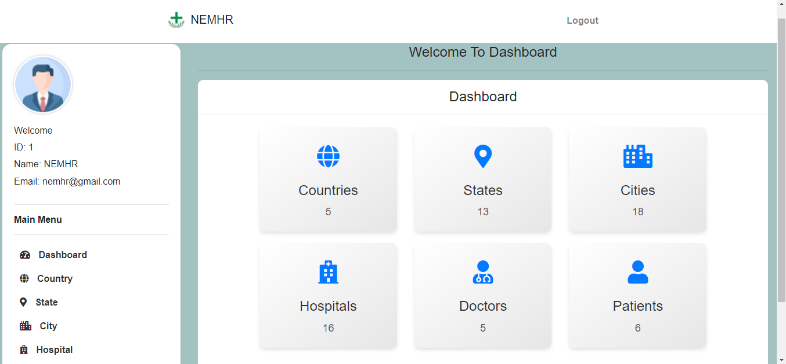
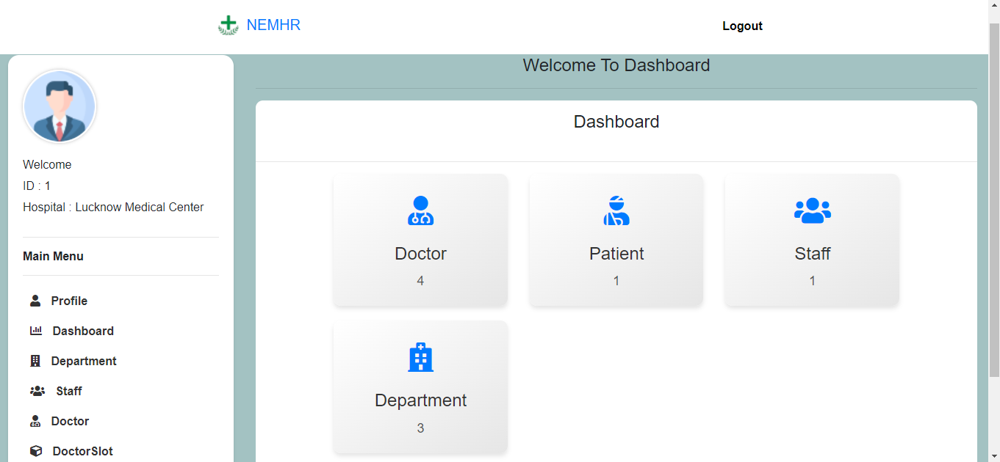
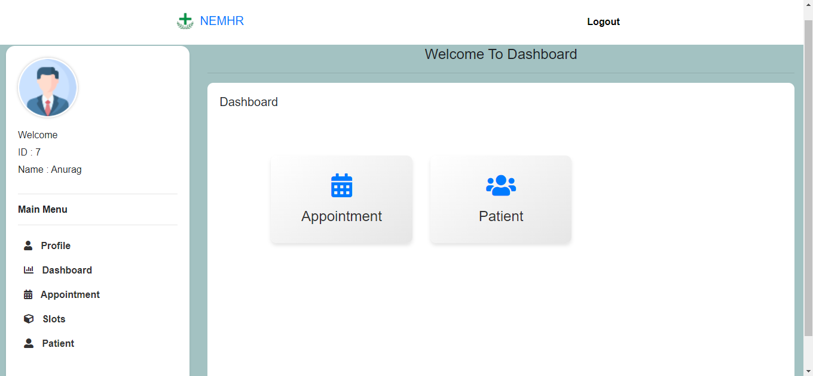
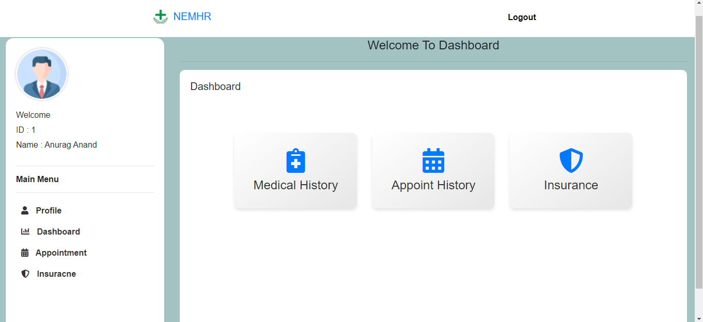

# National Electronic Medical Health Record (NEMHR)

## Introduction

Welcome to the National Electronic Medical Health Record (NEMHR) repository! NEMHR is a state-of-the-art system designed to revolutionize healthcare record management on a national scale. This repository contains all the necessary resources to understand, deploy, and contribute to NEMHR.

## Features

- **Centralized Record Management**: NEMHR provides a centralized platform for storing and managing electronic medical records for individuals across the nation.

- **Secure Access Control**: Security is paramount in healthcare. NEMHR implements robust access control mechanisms to ensure that only authorized personnel can access sensitive medical information.

- **Scalability**: As healthcare needs evolve, NEMHR scales effortlessly to accommodate growing volumes of medical records and users.

- **Compliance**: NEMHR complies with all relevant healthcare regulations and standards, ensuring that patient data is handled ethically and securely.

## Screenshots

### Home Page 

### Admin Page 

### Hospital Page 

### Doctor Page 

### Patient Page 

